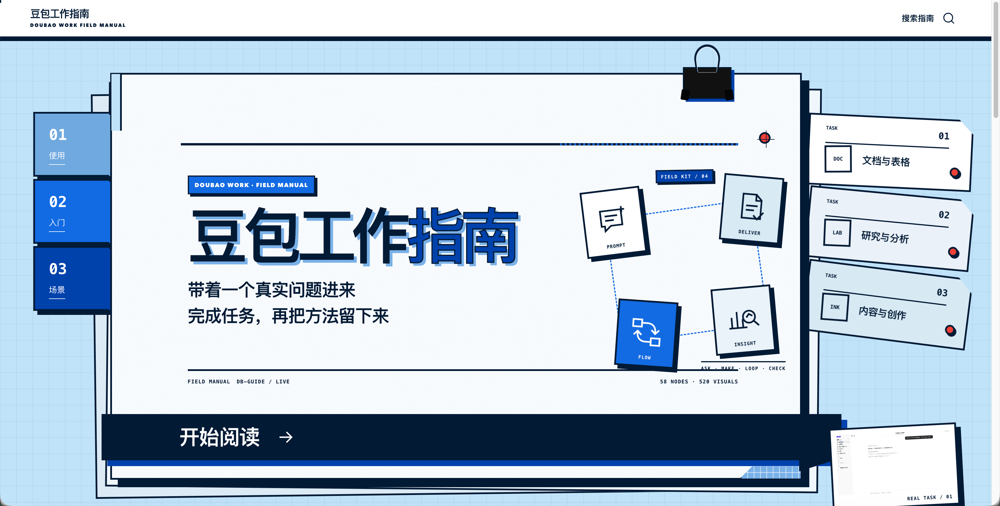

<p align="center">
  
</p>

<h1 align="center">豆包工作指南</h1>

<p align="center"><strong>从一个真实问题进入，完成任务，再把方法留下来</strong></p>

<p align="center">
  <a href="#项目简介">项目简介</a> ·
  <a href="#你会在这里看到什么">内容结构</a> ·
  <a href="#本地预览">本地预览</a> ·
  <a href="#内容维护">内容维护</a> ·
  <a href="#目录结构">目录结构</a> ·
  <a href="#部署计划">部署计划</a>
</p>


> 这不是一份功能列表，而是一本以真实任务为主线的豆包工作实践指南。内容从安装、第一次使用和基础能力开始，逐步进入文档处理、自动化、多 Agent、内容创作、电商和金融研究等工作场景。

## 项目简介

本项目是一套围绕真实工作任务整理的豆包工作实践指南，同时提供适合连续阅读和快速检索的独立网站。

内容与展示层彼此分离。章节正文、图片和视频由统一的数据结构驱动；日常更新内容时，无需手工重做页面或调整整体架构。

网站目前提供：

- 完整章节侧边栏与页内目录
- 全文搜索与前后章节导航
- 图片双栏、三栏和大图查看
- 本地视频播放与网页兼容转码
- 桌面端和手机端适配
- 本地化媒体资源与独立的公开展示内容

当前状态：**本地预览已完成，GitHub 与 Cloudflare 尚未发布。**

## 你会在这里看到什么

| 部分 | 内容 |
| --- | --- |
| 使用篇 | 下载、安装、主界面、第一个任务、连接器、Skill、工作伙伴、API、自动化和多 Agent |
| 入门篇 | Word、Excel、PPT、飞书协作、文件整理、远程控制、生活事务和资讯简报 |
| 场景篇 | 个人提效、自媒体、知识管理、电商和金融研究等真实工作流 |
| 指令模板 | 可直接复用的任务描述、约束条件、验收标准和安全边界 |

具体章节和顺序以网站为准；目录会随内容版本持续更新。

## 推荐阅读方式

- 第一次接触豆包工作：从「使用篇」开始，先跑通第一个可验收任务。
- 已经有明确问题：直接进入「入门篇」或「场景篇」寻找相近案例。
- 准备复用工作流：重点查看案例中的输入材料、任务描述、执行过程和验收方法。
- 维护本项目：先阅读下方的内容维护规则，避免直接修改自动生成文件。

## 本地预览

网站是纯静态页面，不需要安装前端依赖。在项目根目录运行：

```bash
python3 -m http.server 4173 --bind 127.0.0.1 --directory site
```

然后打开：

```text
http://127.0.0.1:4173/
```

如端口已被占用，可以把 `4173` 换成其他端口。

## 内容维护

以下公开站点内容由维护工具生成，不建议手工修改：

- `site/content/site-content.json`
- `site/media/`

需要调整网站结构或视觉样式时，修改：

- `site/index.html`
- `site/app.js`
- `site/styles.css`

内容数据与展示逻辑相互独立。这样可以在不改变网站架构的情况下持续更新正文与媒体。

## 目录结构

```text
doubaowork-guide/
├── assets/
│   ├── readme-home.png          # README 网站预览图
│   └── screenshots/             # 内容与首页素材
├── site/
│   ├── assets/                  # 网站静态素材
│   ├── content/                 # 网站公开内容数据
│   ├── media/                   # 本地化图片与视频
│   ├── app.js                   # 页面渲染、搜索与交互
│   ├── styles.css               # 响应式视觉样式
│   └── index.html               # 网站入口
├── .gitignore                   # 本地与内部文件排除规则
└── README.md
```

## 部署计划

网站不需要构建步骤，静态发布目录为 `site`。

计划采用：

- GitHub：保存网站代码和可公开内容
- Cloudflare Pages：托管静态网站
- Cloudflare R2：存放大体积视频等媒体资源

正式发布前会先整理 Git 忽略规则和媒体存储方式。当前 `site/media/` 体积较大，不应直接全部提交到 GitHub。

## 作者们

感谢以下作者共同参与《豆包工作指南》的创作与维护。点击名片可查看原图并扫描二维码。

<p align="center">
  <a href="./assets/authors/jia-mu-wei-lai-pai.png"></a>
  <a href="./assets/authors/mo-yu-xiao-li.png"></a>
</p>

<p align="center">
  <a href="./assets/authors/dai-shu-di-ai-ke-zhan.png"></a>
  <a href="./assets/authors/cang-he.png"></a>
</p>

<p align="center">
  <a href="./assets/authors/liu-cong-nlp.png"></a>
</p>

## 声明

本项目是面向真实工作任务整理的社区实践指南，不是豆包工作的官方产品文档。涉及产品功能、界面、价格、权限和可用范围等可能变化的信息时，请以官方渠道为准。

公开站点只包含阅读所需的内容与媒体；授权信息、内部快照和其他非公开资料不应进入公开仓库。

## 开源协议

项目尚未确定最终开源协议。正式发布到 GitHub 前，需要补充并确认 `LICENSE` 文件。
